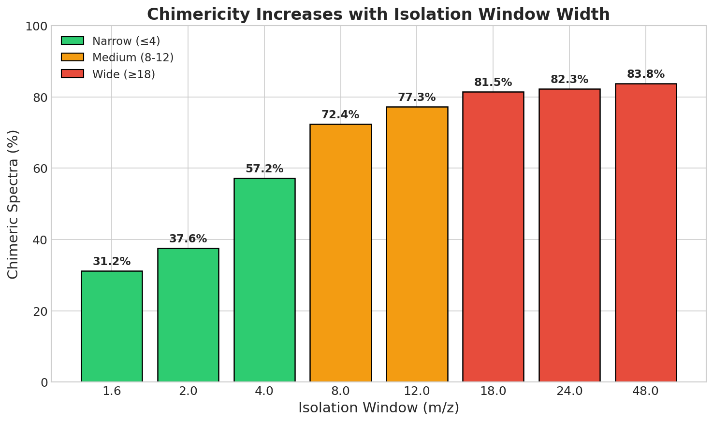
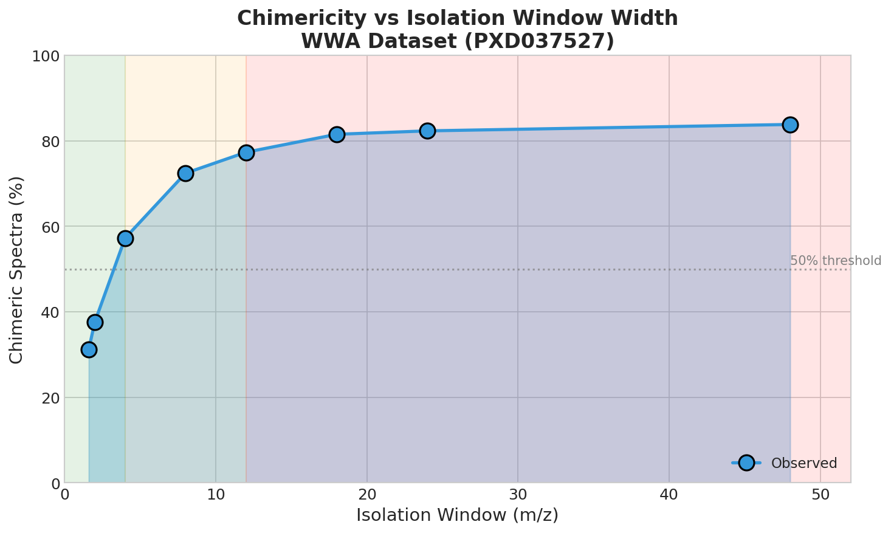
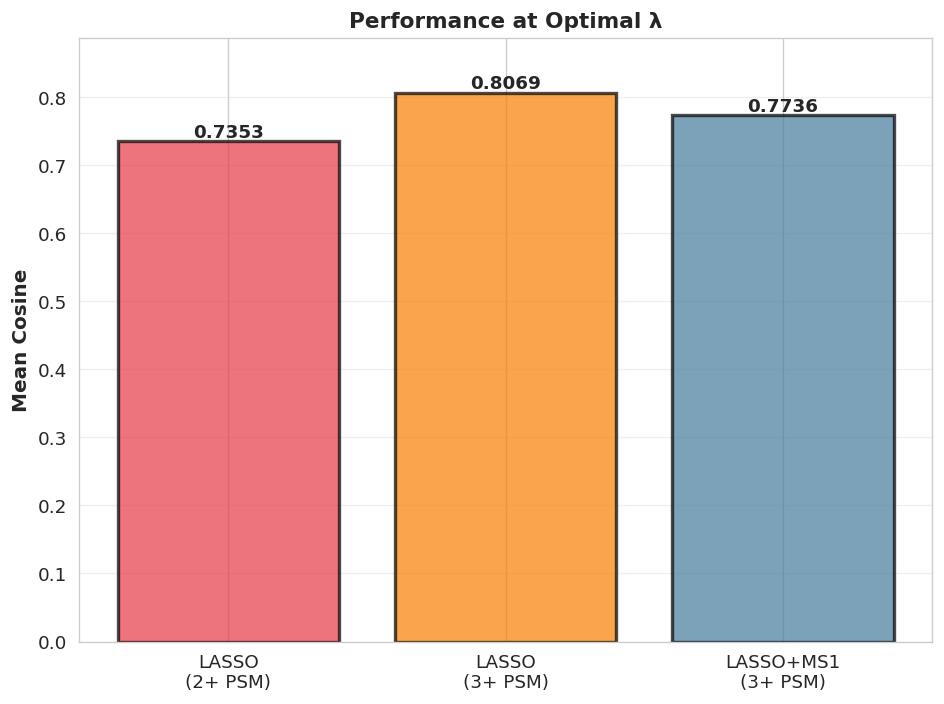
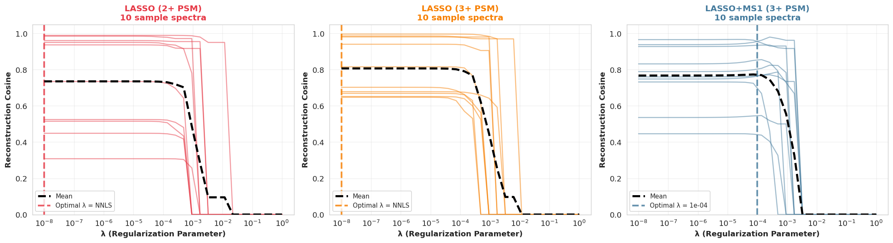
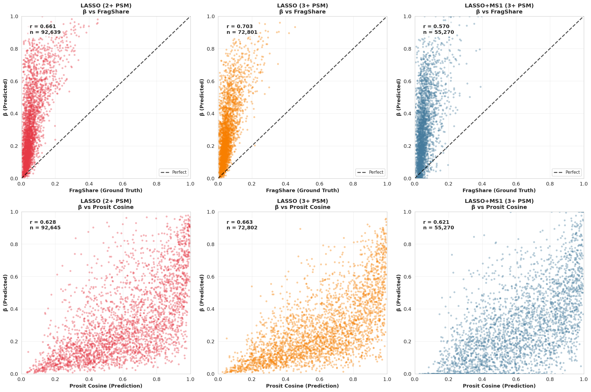

<p align="center">
  
</p>

<h1 align="center">🔬 Exploring Fragmentation Competition in Proteomics Data to Decode Chimeric Spectra</h1>

<p align="center">
  <strong>A computational framework for deconvolving chimeric MS2 spectra using LASSO regression and deep learning predictions</strong>
</p>

<p align="center">
  <a href="#-key-findings">Key Findings</a> •
  <a href="#-pipeline-overview">Pipeline</a> •
  <a href="#-methods">Methods</a> •
  <a href="#-results">Results</a> •
  <a href="#-hpc-infrastructure">HPC</a> •
  <a href="#-usage">Usage</a>
</p>

---

## 📖 Abstract

Traditional MS/MS search algorithms assume each spectrum originates from a single peptide. In reality, **co-isolation and co-fragmentation** of multiple precursors generate **chimeric spectra**—a prevalent phenomenon that complicates peptide identification and quantification.

This project investigates **fragmentation competition** in chimeric spectra by:
- Analyzing wide-window acquisition data (1.6–48 m/z isolation windows)
- Integrating **Prosit** deep learning predictions for spectral templates
- Developing **LASSO-based deconvolution** to estimate peptide contributions
- Demonstrating that **MS1 abundance does NOT predict MS2 fragmentation dominance**

> **Key insight**: Linear mixture models achieve ~80% reconstruction cosine similarity, and performance *improves* with spectral complexity—chimeric spectra are recoverable signal, not noise.

---

## 🎯 Key Findings

| Finding | Implication |
|---------|-------------|
| MS1 intensity is a **poor predictor** of MS2 dominance | Don't use MS1 as prior for deconvolution |
| Linear models achieve **0.803 mean cosine** reconstruction | Additive fragmentation assumption holds |
| Reconstruction quality **increases with chimericity** | Complex spectra contain more orthogonal information |
| LASSO selected **λ = 0** (no regularization needed) | High-quality PSM filtering eliminates false candidates |

---

## 🔄 Pipeline Overview

```
┌─────────────────────────────────────────────────────────────────────────────┐
│                           DATA ACQUISITION                                   │
├─────────────────────────────────────────────────────────────────────────────┤
│  PRIDE PXD037527 ──► 58 LC-MS/MS runs (Wide-Window Acquisition)             │
│  Isolation windows: 1.6 - 48 m/z                                            │
└─────────────────────────────────────────────────────────────────────────────┘
                                    │
                                    ▼
┌─────────────────────────────────────────────────────────────────────────────┐
│                           PREPROCESSING                                      │
├─────────────────────────────────────────────────────────────────────────────┤
│  01_download_raw.py        │ Download RAW files from PRIDE                  │
│  02_convert_raw_to_mzml.py │ ThermoRawFileParser (--noPeakPicking)          │
│  03_load_psm_clean.py      │ Load MSFragger-DDA+ results, filter FDR        │
└─────────────────────────────────────────────────────────────────────────────┘
                                    │
                                    ▼
┌─────────────────────────────────────────────────────────────────────────────┐
│                        CHIMERIC ANALYSIS                                     │
├─────────────────────────────────────────────────────────────────────────────┤
│  04_chimeric_analysis.ipynb                                                 │
│  ├── Identify chimeric spectra (≥2 PSMs per scan)                          │
│  ├── Stratify by isolation window width                                     │
│  └── Quantify chimericity distributions                                     │
└─────────────────────────────────────────────────────────────────────────────┘
                                    │
                                    ▼
┌─────────────────────────────────────────────────────────────────────────────┐
│                    ANNOTATION & PROSIT INTEGRATION                           │
├─────────────────────────────────────────────────────────────────────────────┤
│  05_Annotation&Prosit.ipynb                                                 │
│  ├── Fragment ion annotation (b/y ions, 20 ppm tolerance)                   │
│  ├── Prosit API queries via Koina (NCE=30%)                                 │
│  ├── Compute FragShare, Prosit cosine, concordance metrics                  │
│  └── Build mass-channel representation                                       │
└─────────────────────────────────────────────────────────────────────────────┘
                                    │
                                    ▼
┌─────────────────────────────────────────────────────────────────────────────┐
│                      LASSO DECONVOLUTION                                     │
├─────────────────────────────────────────────────────────────────────────────┤
│  06_LASSO.ipynb                                                             │
│  ├── Design matrix X: Prosit predictions on mass channels                   │
│  ├── Response vector y: experimental intensities                            │
│  ├── Non-negative LASSO: β̂ = argmin ||y - Xβ||² + λ||β||₁, β ≥ 0          │
│  └── Hyperparameter selection via grid search                               │
└─────────────────────────────────────────────────────────────────────────────┘
                                    │
                                    ▼
┌─────────────────────────────────────────────────────────────────────────────┐
│                           OUTPUTS                                            │
├─────────────────────────────────────────────────────────────────────────────┤
│  plots/                    │ Publication-ready figures                       │
│  processed_data/           │ Concordance tables, correlation matrices        │
│  analysis/                 │ Summary statistics (JSON)                       │
└─────────────────────────────────────────────────────────────────────────────┘
```

---

## 📊 Results

### Chimericity Scales with Isolation Window Width

Wider isolation windows systematically increase co-fragmentation probability—from 42% (narrow) to 83% (wide).

<p align="center">
  
  
</p>

### LASSO Reconstruction Quality

The LASSO model achieves strong spectral reconstruction, with performance **improving** at higher chimericity levels.

<p align="center">
  
</p>

| Model | Validation Spectra | Mean Cosine | Correlation with FragShare |
|-------|-------------------|-------------|---------------------------|
| LASSO (2+ PSM) | 29,991 | 0.795 ± 0.165 | r = 0.661 |
| **LASSO (3+ PSM)** | **20,044** | **0.803 ± 0.152** | **r = 0.703** |
| LASSO+MS1 (3+ PSM) | 15,357 | 0.756 ± 0.156 | r = 0.570 |

### Regularization Paths

LASSO models selected λ = 0, while MS1-augmented models required regularization to compensate for ionization bias.

<p align="center">
  
</p>

### Prediction Quality

Mixing coefficients (β) correlate strongly with fragment-based ground truth, validating the deconvolution approach.

<p align="center">
  
</p>

---

## 🖥️ HPC Infrastructure

This analysis was executed on the **Vlaams Supercomputer Center (VSC)** infrastructure at the University of Antwerp.

### Computational Resources

| Stage | Cores | Memory | Runtime | Notes |
|-------|-------|--------|---------|-------|
| RAW → mzML conversion | 1 | 8 GB | ~2h/file | ThermoRawFileParser |
| Prosit API queries | 4 | 16 GB | ~12h total | Rate-limited API calls |
| Fragment annotation | 32 | 64 GB | ~8h | Parallel processing |
| LASSO fitting | 64 | 128 GB | ~4h | Grid search parallelized |

### SLURM Job Configuration

```bash
#!/bin/bash
#SBATCH --job-name=lasso_deconv
#SBATCH --ntasks=1
#SBATCH --cpus-per-task=64
#SBATCH --mem=128G
#SBATCH --time=12:00:00
#SBATCH --partition=broadwell

module load Python/3.9.6-GCCcore-11.2.0
source $VSC_DATA/venv/bin/activate

python run_lasso_analysis.py
```

### Dataset Scale

| Metric | Value |
|--------|-------|
| Total PSMs | 1,276,641 |
| Unique MS2 spectra | 693,596 |
| Chimeric spectra (≥2 PSMs) | 355,592 (51.3%) |
| Prosit predictions generated | ~1.1M |
| Total processing time | ~48 hours |

---

## 📁 Repository Structure

```
v.3.0.0/
├── 📄 README.md                          # This file
├── 📄 README_preprocess.md               # Preprocessing documentation
│
├── 🐍 SCRIPTS
│   ├── 01_download_raw.py                # PRIDE data download
│   ├── 02_convert_raw_to_mzml.py         # RAW to mzML conversion
│   ├── 03_load_psm_clean.py              # PSM loading and filtering
│   ├── biosaur_simple.py                 # MS1 feature utilities
│   └── extract_biosaur_parallel_clean.py # Parallel feature extraction
│
├── 📓 NOTEBOOKS
│   ├── 04_chimeric_analysis.ipynb        # Chimericity characterization
│   ├── 05_Annotation&Prosit.ipynb        # Fragment annotation + Prosit
│   └── 06_LASSO.ipynb                    # LASSO deconvolution
│
├── 📊 plots/
│   ├── 01_chimeric_analysis/             # Chimericity figures
│   │   ├── plot1_chimericity_by_window.png
│   │   ├── plot2_psm_distribution_by_category.png
│   │   └── plot3_chimericity_trend.png
│   ├── 05_ranking_analysis/              # Concordance & correlation
│   │   ├── concordance_heatmaps.png
│   │   ├── correlation_heatmaps.png
│   │   └── ...
│   ├── performanceLASSO.png
│   ├── regularizationPaths.png
│   └── predictionQuality.png
│
├── 📁 figures/                           # Static assets for README
│   └── uantwerpen_logo.png               # University logo (ADD THIS)
│
├── 📁 analysis/
│   └── 07_lasso_deconvolution/
│       └── summary_chimerys.json         # Summary statistics
│
└── 📁 processed_data/                    # Output data (large files excluded)
    ├── *.csv                             # Concordance/correlation tables
    └── *.png                             # Additional figures
```

---

## 🛠️ Requirements

```python
# Core
pandas>=1.5.0
numpy>=1.21.0
scipy>=1.9.0
scikit-learn>=1.1.0

# Mass Spectrometry
pyteomics>=4.5
spectrum_utils>=0.4.0

# Visualization
matplotlib>=3.6.0
seaborn>=0.12.0

# API
requests>=2.28.0
```

### Installation

```bash
# Clone repository
git clone https://github.com/aminb00/Exploring-Fragmentation-Competion-in-Proteomics-Data-to-Decode-Chimeric-Spectra.git
cd Exploring-Fragmentation-Competion-in-Proteomics-Data-to-Decode-Chimeric-Spectra/v.3.0.0

# Create virtual environment
python -m venv venv
source venv/bin/activate  # Linux/Mac
# or: venv\Scripts\activate  # Windows

# Install dependencies
pip install -r requirements.txt
```

---

## 📚 Methods Summary

### Mass-Channel Representation

Unlike conventional binning, we use **dynamic mass channels** defined only at Prosit-predicted fragment positions:

1. Collect all Prosit-predicted m/z values across candidate peptides
2. Merge peaks within ±20 ppm tolerance into channels
3. Project experimental spectrum onto these channels
4. Build design matrix **X** ∈ ℝ^(M×K) and response **y** ∈ ℝ^M

### LASSO Deconvolution Model

```
ŷ ≈ Xβ,  β ≥ 0

β̂ = argmin { ½||y - Xβ||₂² + λ||β||₁ }
     β≥0
```

Where:
- **y**: L1-normalized experimental intensities
- **X**: L1-normalized Prosit predictions (columns = peptides)
- **β**: mixture coefficients (peptide contributions)
- **λ**: regularization parameter (selected via grid search)

---

## 📖 Citation

```bibtex
@misc{borqal2026chimeric,
  author = {Borqal, Mohammed Amin and Adams, Charlotte and Bittremieux, Wout},
  title = {Exploring Fragmentation Competition in Proteomics Data to Decode Chimeric Spectra},
  year = {2026},
  publisher = {GitHub},
  url = {https://github.com/aminb00/Exploring-Fragmentation-Competion-in-Proteomics-Data-to-Decode-Chimeric-Spectra}
}
```

---

## 🙏 Acknowledgements

- **Prof. Wout Bittremieux** — Scientific guidance and mentorship
- **Dr. Charlotte Adams** — Supervision and continuous support
- **BittremieuxLab**, University of Antwerp
- **Vlaams Supercomputer Center (VSC)** — Computational resources
- **PRIDE/ProteomeXchange** — Public proteomics data (PXD037527)

---

## 📧 Contact

**Mohammed Amin Borqal**  
Exchange Student, MSc Computer Engineering  
University of Bergamo, Italy | University of Antwerp, Belgium  
📧 [amin.borqal@student.uantwerpen.be](mailto:amin.borqal@student.uantwerpen.be)

---

<p align="center">
  <sub>Made with ❤️ at the University of Antwerp</sub>
</p>
